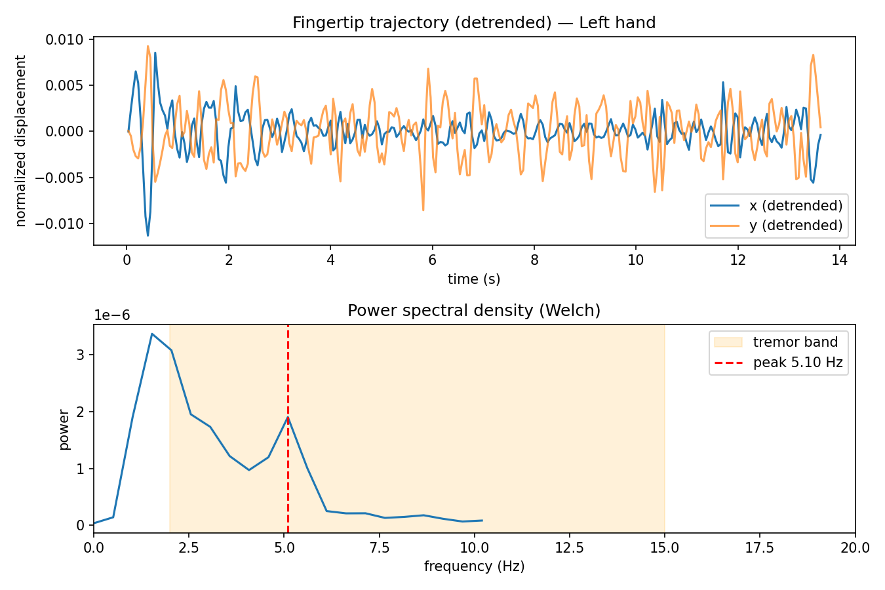

# BioMotion — webcam hand-motion tracking for biomedical signal extraction

A solo, no-dataset-required project: use off-the-shelf hand-landmark tracking
(MediaPipe) as the "sensor," and get the clinically meaningful signal out
with plain signal processing (FFT/Welch PSD, peak detection, joint-angle
geometry) rather than a trained model. This sidesteps the "no open medical
dataset" problem entirely — the tracking backbone is pretrained on general
hand data, and every metric below is math, not a black box that needs labels.

Two things live here:

- **`python/`** — capture + rigorous offline analysis: tremor frequency,
  finger-tap rhythm, amplitude/speed **decrement** (bradykinesia-style),
  per-finger range of motion, and **bilateral left-vs-right asymmetry**.
  This is the part with actual numbers you can validate.
- **`web/`** — a live, in-browser demo: glowing trail-cursor effect, a
  real-time frequency readout, and a digitized **spiral-tracing test** (the
  classic Archimedes-spiral tremor test). This is the shareable/social-media
  piece — same underlying ideas, running fully client-side.

## Demo

<p align="center">
  
</p>

Hands-free 15-second clip, no face, live glowing fingertip trail + a live
tremor-frequency readout computed the same way as `analyze_tremor.py`
(Welch PSD + peak detection), not a canned animation. Recorded with:
```
python record_demo.py --seconds 15
```
It counts down 3s (time to position your hand(s) in frame), then records and
auto-saves `docs/demo.mp4` + `docs/demo.gif` with no keypresses needed.

## Why this matters for rehab, not just as a demo

The specific numbers this pipeline produces map directly onto things a
physical/occupational therapist already tracks by eye or with a stopwatch —
the difference is turning a subjective impression into a logged, comparable
number:

- **Tremor frequency/amplitude over time** — a therapist tracking essential
  tremor or post-stroke tremor currently relies on visual impression session
  to session ("looks a bit better today"). A webcam clip run through
  `analyze_tremor.py` gives an actual number to plot across weeks, so
  "better" becomes a trend line instead of a guess.
- **Amplitude/speed decrement in finger-tapping** (`analyze_decrement.py`) is
  literally part of the standard bradykinesia exam (MDS-UPDRS item 3.6) —
  today it's scored 0-4 by eye in a clinic visit. A webcam version means a
  patient could self-administer the same test between visits and send the
  therapist a real decrement curve instead of waiting for the next
  appointment to be observed once.
- **Range of motion** (`analyze_rom.py`) replaces a goniometer for
  finger-flexion tracking after hand surgery or in stroke rehab — useful for
  home exercise compliance, where a patient can't bring a physical goniometer
  to every session but has a laptop webcam.
- **Bilateral asymmetry** (`analyze_asymmetry.py`) is exactly the kind of
  side-to-side comparison used to track whether a stroke-affected hand is
  catching up to the unaffected hand over the course of rehab — a number
  that's hard to eyeball reliably but trivial to compute once both hands are
  tracked.

None of this is a diagnostic claim — it's a **measurement tool** a patient
could plausibly use at home between clinical visits, turning "I think I'm
improving" into a chart a therapist can actually look at. That's the real
value of a $0 webcam + open-source model pipeline: not replacing a clinician,
but closing the gap between appointments with objective, repeatable numbers.

## What makes this more than a filter

Most "hand tracking + cool trail" demos stop at the visual. This project
tries to go one layer deeper on both the measurement side and the clinical
framing side:

- **Amplitude/speed decrement, not just tap rate.** MDS-UPDRS finger-tapping
  scoring cares most about whether amplitude and speed *shrink over a
  sequence* (bradykinesia) and whether there are hesitations/halts — not raw
  taps/sec. `analyze_decrement.py` fits a linear trend per metric across the
  tap sequence and flags outlier-long intervals as hesitations.
- **Bilateral asymmetry.** Parkinsonian tremor/bradykinesia is frequently
  asymmetric, especially early on. `capture.py` tracks both hands
  simultaneously with left/right handedness labels, and
  `analyze_asymmetry.py` reports a normalized asymmetry index
  (`|L-R|/(L+R)`) per metric — something a single-hand demo structurally
  can't show.
- **Full 21-landmark logging**, not just fingertip position — enables
  per-finger joint-angle ROM (`analyze_rom.py`) computed retroactively from
  any existing recording, no new capture needed.
- **Digitized spiral-tracing test** (web demo) — the actual Archimedes
  spiral test used in real tremor research (e.g. the NewHandPD dataset),
  scored live as RMS deviation from the ideal spiral, with the trail
  color-coded green→red by accuracy.

## Why this is a legitimate mini-research project, not just a filter

Framed honestly, this is a **methods validation** project, not a diagnostic
tool: "can a $20 webcam + open-source pose model recover clinically known
signals (tremor frequency, tap decrement, joint ROM, bilateral asymmetry) to
within an acceptable error, without any labeled medical dataset?" That's a
real, answerable question you can validate solo:

1. **Tremor frequency** — shake your hand in time with a metronome at a known
   BPM. The detected frequency should track `metronome_bpm / 60`. Try
   several BPMs (120, 180, 300 => 2, 3, 5 Hz) for an error-vs-frequency
   curve. Compare a still-hand baseline too (near-zero in-band power).
2. **Tap decrement** — tap normally for the first half of a clip, then
   deliberately let your amplitude/speed fade for the second half. The
   decrement slope should visibly go negative; a clip with constant tapping
   throughout should show a near-zero slope. This is your "does the metric
   actually detect decrement when it's really there" sanity check.
3. **ROM** — hold a printed protractor in frame, bend a finger to marked
   angles, compare against `analyze_rom.py`'s reported angle at those frames.
4. **Bilateral asymmetry** — deliberately shake one hand more than the other;
   the asymmetry index should be clearly > 0. Shake both hands identically;
   it should be close to 0. That's your positive/negative control pair.
5. **Reference literature values** — Parkinsonian rest tremor is reported at
   ~4-6 Hz, essential tremor ~4-12 Hz. Report where your self-recorded
   "simulated tremor" falls relative to those bands, as a sanity check, not
   a diagnosis.

This N=1, self-validated-against-a-known-reference design is a standard way
solo/early biomedical engineering projects establish that a measurement
*method* works, before anyone talks about clinical datasets or trials.

## Actual validation results (tremor frequency, metronome-paced)

Real run against `analyze_tremor.py`, hand shaken in time with an online
metronome, ~13-15s per clip, webcam sampling at ~21 fps:

| Target | Metronome-implied freq | Detected | Verdict |
|---|---|---|---|
| still baseline | 0 Hz | no peak found | correct |
| tremor_2hz | 2.0 Hz | 2.04 Hz | matches closely |
| tremor_3hz | 3.0 Hz | 5.10 Hz | mismatch (drifted faster than the metronome) |
| tremor_5hz | 5.0 Hz | no peak found | not detected |

<table>
<tr>
<td><br><sub>Still baseline — flat spectrum, correctly reports "no peak"</sub></td>
<td><br><sub>tremor_2hz — clean 2.04 Hz peak, matches the 2 Hz metronome target</sub></td>
</tr>
<tr>
<td colspan="2"><br><sub>tremor_3hz — small in-band bump near 5 Hz, but dominated by low-frequency (&lt;1 Hz) arm drift; illustrates why the high-pass filter step (below) matters</sub></td>
</tr>
</table>

Two things worth reporting honestly rather than hiding:

- **2 Hz validates cleanly** (~2% error against a known reference).
- **There's a real frequency ceiling around ~5-6 Hz.** A standard webcam
  samples at ~20-21 fps; by the Nyquist limit you need meaningfully more than
  2 samples per cycle to reliably resolve a frequency, so this pipeline's
  practical tremor-frequency ceiling sits well below true Parkinsonian tremor
  range (4-6 Hz) in the worst case. Published vision-based-tremor work that
  targets higher frequencies generally uses 60-120fps cameras, not consumer
  webcams — this is a legitimate, citable limitation of the approach, not a
  bug to paper over.

This also surfaced (and led to fixing) two real bugs in the analysis code:
naive `argmax()`-over-a-band peak detection was reporting the band's edge as
a "peak" even for a stationary hand with no oscillation at all (fixed by
requiring a genuine local maximum via `scipy.signal.find_peaks` with a
prominence threshold), and slow arm/wrist drift during a "shake" was
swamping smaller real tremor-band peaks in the spectrum (fixed by a
Butterworth high-pass filter before Welch's method). Both are in
`tremor_math.py` — worth mentioning in a writeup as an example of catching a
methods artifact through validation rather than trusting the first plausible
number.

## Setup

```
cd python
pip install -r requirements.txt
```

Download the hand-landmark model once (newer `mediapipe` builds dropped the
old bundled `solutions` API, so this project uses the Tasks API + an
explicit model file):

```
curl -L -o models/hand_landmarker.task https://storage.googleapis.com/mediapipe-models/hand_landmarker/hand_landmarker/float16/1/hand_landmarker.task
```

## Python: capture

```
python capture.py --session tremor_baseline
```

- Tracks up to 2 hands by default (`--num-hands 1` to limit to one).
- Press **r** to start/stop recording (writes `../data/<session>.csv`, one
  row per hand per frame, all 21 landmarks + handedness label).
- Press **c** to clear the on-screen trail.
- Press **q** to quit.
- Left hand trail draws cyan-ish, right hand orange-ish, so you can see both
  being tracked live.

Record a few sessions:
- `still_baseline` — hand(s) held as still as possible.
- `tremor_3hz`, `tremor_5hz` — shake in time with a metronome.
- `taps_test` — thumb-index tapping test, ~10+ taps, let it fade toward the end.
- `bilateral_test` — both hands visible, shake one more than the other.
- Finger flexion/extension through full range, for ROM.

## Python: analyze

All analysis scripts accept `--hand Left` / `--hand Right` (default: whichever
hand has the most recorded rows).

**Tremor frequency** (FFT/Welch PSD):
```
python analyze_tremor.py ../data/tremor_3hz.csv
```
Dominant frequency in the 2-15 Hz band + RMS displacement, with a
trajectory + power-spectrum plot.

**Tap rate & rhythm consistency**:
```
python analyze_taps.py ../data/taps_test.csv
```
Tap rate, mean inter-tap interval, and coefficient of variation (lower =
steadier rhythm).

<br>
<sub>Real recording: 10 taps detected, 0.87 taps/s, rhythm CV 0.42 (fairly irregular first attempt)</sub>

**Amplitude/speed decrement** (the bradykinesia-style metric):
```
python analyze_decrement.py ../data/taps_test.csv
```
Fits a linear trend to per-cycle opening amplitude and speed across the tap
sequence, reports % change over the sequence, and flags hesitations (any
inter-tap interval much longer than the running median).

<br>
<sub>Same recording: amplitude trend +1.9% (no decrement), 0 hesitations flagged</sub>

**Per-finger range of motion**:
```
python analyze_rom.py ../data/rom_test.csv
```
PIP joint angle over time for every finger, with min/max/ROM in degrees —
a webcam replacement for a physical goniometer.

<br>
<sub>~176-178° range of motion across all four fingers, full flexion to extension</sub>

**Bilateral asymmetry** (needs both hands recorded in the same clip):
```
python analyze_asymmetry.py ../data/bilateral_test.csv
```
Left vs. right values for tremor frequency/power and tap rate, plus a
normalized asymmetry index (`|L-R|/(L+R)`, 0 = symmetric, 1 = fully one-sided).

## Web demo (the shareable one)

Needs a local server (browsers block camera access when opened directly as
a `file://` URL on some setups):

```
cd web
python -m http.server 8000
```
Then open `http://localhost:8000` in Chrome/Edge and allow camera access.

Three modes (top-right buttons):
- **Tremor** — glowing orange trail, live tremor-frequency readout from an
  in-browser DFT (Goertzel-style, 2-15 Hz) on a rolling 3-second buffer —
  genuine signal processing at frame rate, not a canned effect.
- **Tap test** — cyan trail, live taps/sec from thumb-index pinch distance
  with hysteresis debouncing.
- **Spiral trace** — traces a guide Archimedes spiral on screen; your
  fingertip trail is color-coded green (on target) to red (off target)
  based on live distance to the ideal spiral, with a running RMS deviation
  score. This is the actual clinical spiral test, digitized.

Press **r** any time to reset the trail/score.

Screen-record this for the social-media-style demo — same measurement
principles as the Python analysis, just live and without needing to
export/replot.

## Data schema

`capture.py` writes one row per hand per frame:
`frame, t_sec, hand, handedness_score, lm0_x, lm0_y, lm0_z, ... lm20_x, lm20_y, lm20_z`
(`lm{i}` follows standard MediaPipe hand-landmark indexing — see
`landmarks.py` for named constants, e.g. `INDEX_TIP = 8`.)

## Extending

Ideas that reuse the same landmark stream without any new capture work:
- **Inter-finger independence** — during a tapping task, do the non-tapping
  fingers stay still, or move in sympathy (a spasticity/coordination
  marker)? Compute ROM of the *other* fingers during `analyze_decrement.py`'s
  tap windows.
- **Grip aperture over time** — thumb-to-any-fingertip distance during a
  reach-to-grasp motion, used in stroke/Parkinson's kinematics research.
- **Spiral test in Python** — port the web demo's spiral scoring into an
  offline script so spiral sessions can be recorded and re-analyzed like the
  other tests.
