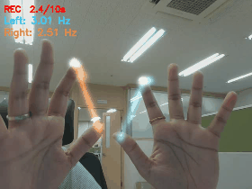
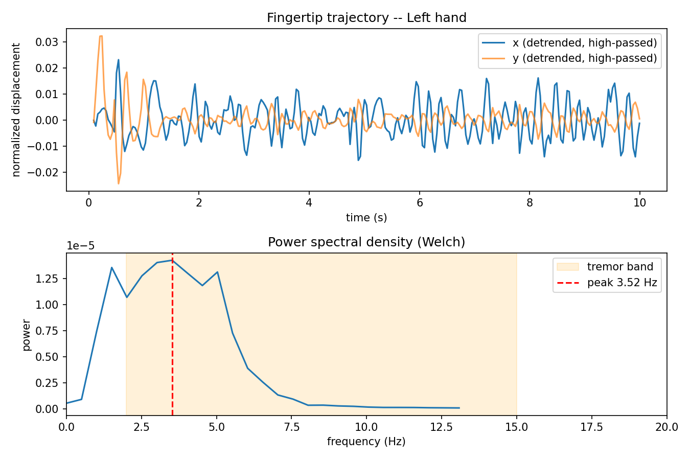
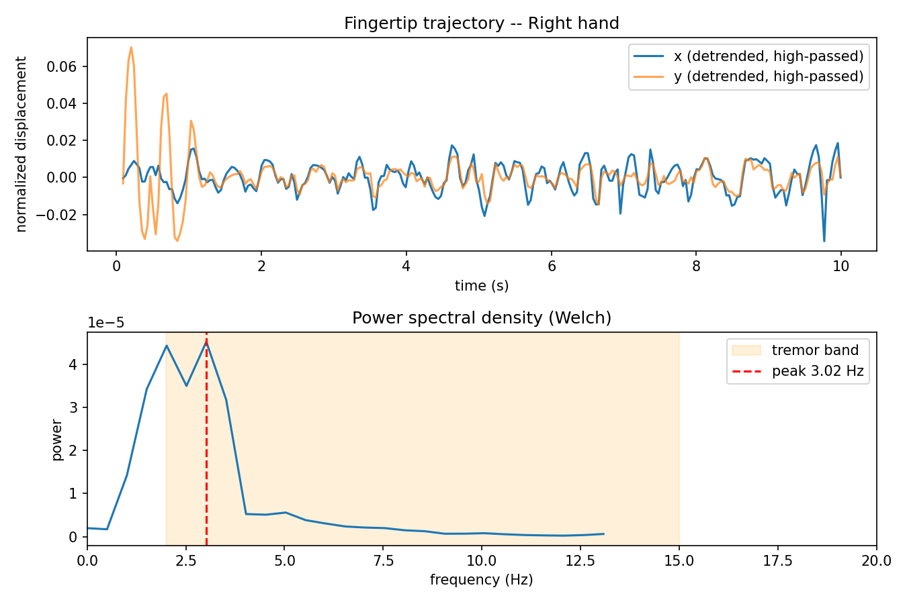
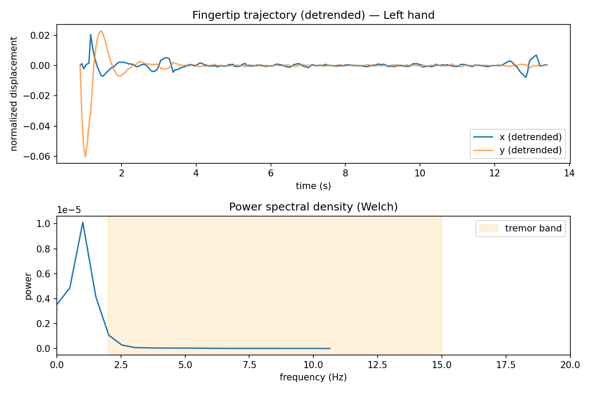
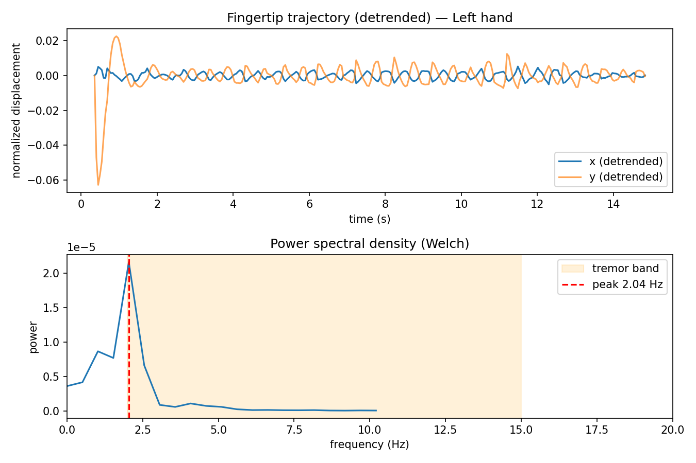
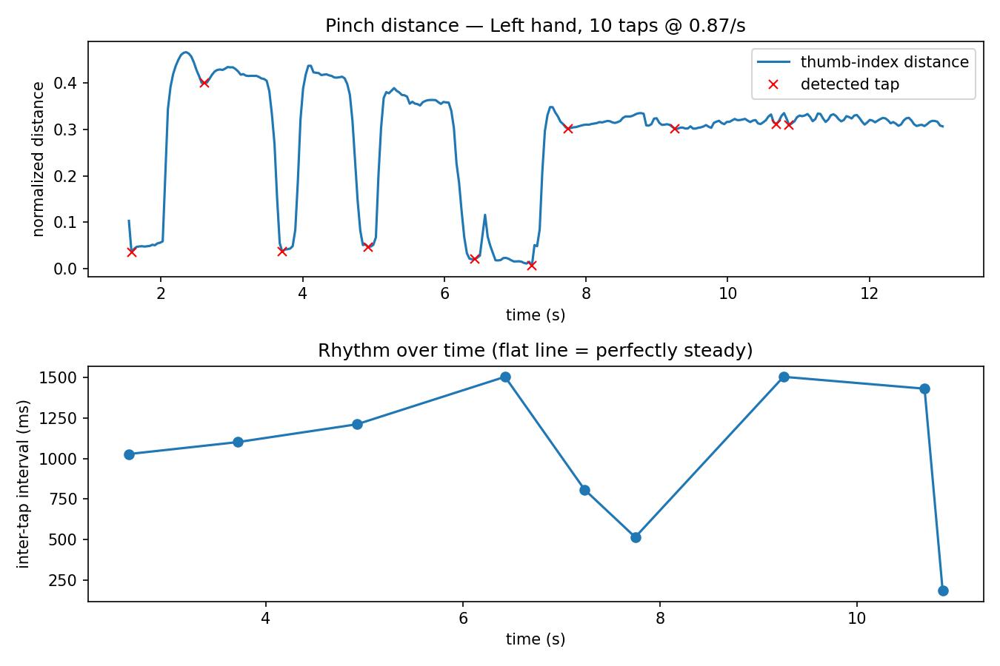
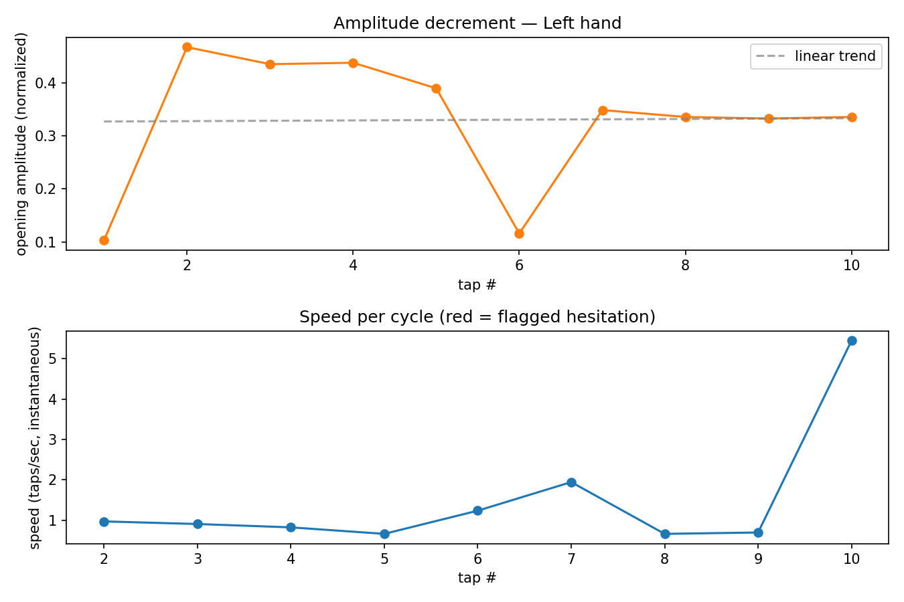
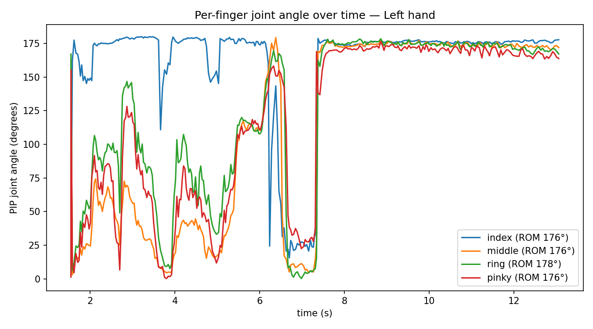

# BioMotion — webcam-based quantitative motor assessment using MediaPipe and classical signal processing

**Goal:** can a consumer webcam and MediaPipe recover clinically relevant
motor metrics — tremor frequency, finger-tapping performance, joint range of
motion, and bilateral asymmetry — using only classical signal processing, no
medical dataset, and no trained model?

| Metric | Clinical relevance |
|---|---|
| Tremor frequency | Parkinson's disease, essential tremor |
| Finger tap rate | Bradykinesia screening |
| Amplitude/speed decrement | MDS-UPDRS motor exam (item 3.6) |
| Joint ROM | Post-surgical / stroke rehab tracking |
| Bilateral asymmetry | Hemiparesis, Parkinsonian asymmetry |

> BioMotion demonstrates that clinically relevant motor metrics can be
> extracted from consumer-grade webcams using markerless hand tracking and
> classical signal processing. It is a research prototype for quantitative
> motor assessment, not a diagnostic tool — it has not been validated
> against patient data or a clinical population.

## What we built

- **`python/`** — capture (both hands, all 21 landmarks/hand) + 5 analysis
  scripts: tremor frequency (FFT/Welch), tap rate & rhythm, amplitude/speed
  decrement (bradykinesia-style), per-finger ROM, bilateral L/R asymmetry.
- **`web/`** — live in-browser version: glowing trail, live frequency
  readout, and a digitized Archimedes spiral-tracing test.

## Demo

<p align="center">
  
</p>

10s clip, both hands tracked live, per-hand frequency readout on screen.
Recorded with `python record_demo.py --seconds 10`, which also auto-saves
the landmark CSV and generates the PSD plot below from that same take:

<p align="center">
  
  
</p>

**Result: Left 3.52 Hz, Right 3.02 Hz** — clean sustained in-band peaks, live, not post-hoc.

## What we did to test it

1. **Tremor frequency**: shook hand in time with a metronome at known BPM,
   compared detected frequency to `BPM/60`. Ran a still-hand baseline too.
2. **Tap decrement**: tapped normally, let amplitude/speed fade — checked
   the decrement slope goes negative when it should.
3. **ROM**: bent fingers through full range, checked angle trace looked right.
4. **Bilateral asymmetry**: shook one hand more than the other, checked the
   asymmetry index responded.

## Results

| Target | Detected | Verdict |
|---|---|---|
| still baseline | no peak | correct |
| 2 Hz metronome | 2.04 Hz | matches (~2% error) |
| 3 Hz metronome | 5.10 Hz | mismatch (see below) |
| 5 Hz metronome | no peak | not detected — webcam fps ceiling (~20fps, Nyquist limits reliable detection above ~5-6 Hz) |

Inspection of the 3 Hz recording's trajectory plot showed the actual hand
motion was tighter and faster than the intended pace — a genuine spectral
peak near 5 Hz, not a harmonic artifact or a tracking glitch (the same
signal was visible directly in the raw x/y trajectory, not just the
spectrum). Most likely explanation: the participant drifted above the
metronome's pace rather than the pipeline mis-detecting a slower motion.
This wasn't independently confirmed against a second sensor, so it remains
a plausible-but-unverified explanation rather than a proven one.

<table>
<tr>
<td></td>
<td></td>
</tr>
</table>

Found and fixed two real bugs during validation: naive peak-search was
reporting the search band's edge as a "peak" for a stationary hand (fixed
with `scipy.signal.find_peaks` + prominence threshold); slow arm drift was
swamping real tremor peaks (fixed with a high-pass filter). Both in
`tremor_math.py`.

Tap / decrement / ROM also run cleanly on real recordings:

<p align="center">



</p>

10 taps @ 0.87/s, rhythm CV 0.42 · amplitude trend +1.9% (no decrement) · 176-178° ROM across fingers.

## Setup

```
cd python
pip install -r requirements.txt
curl -L -o models/hand_landmarker.task https://storage.googleapis.com/mediapipe-models/hand_landmarker/hand_landmarker/float16/1/hand_landmarker.task
```

## Usage

```
python capture.py --session name        # r=record  c=clear trail  q=quit
python analyze_tremor.py ../data/name.csv
python analyze_taps.py ../data/name.csv
python analyze_decrement.py ../data/name.csv
python analyze_rom.py ../data/name.csv
python analyze_asymmetry.py ../data/name.csv   # needs both hands in the clip
python record_demo.py --seconds 10       # hands-free demo recorder
python analyze_reliability.py --target-hz 2.0 ../data/2hz_trial*.csv  # aggregate repeated trials
```

All analysis scripts take `--hand Left`/`--hand Right` (default: whichever
hand has more rows).

Web demo: `cd web && python -m http.server 8000`, open `localhost:8000`.

## Data schema

One row per hand per frame: `frame, t_sec, hand, handedness_score, lm0_x, lm0_y, lm0_z, ... lm20_x, lm20_y, lm20_z`
(standard MediaPipe landmark indexing — see `landmarks.py`).

## Limitations

- Validated only on a healthy participant (self-recorded), not a clinical population.
- Accuracy depends on webcam frame rate and lighting; tested at ~20-21fps.
- Reliable tremor-frequency estimation is limited to roughly below 5-6 Hz at
  that frame rate (Nyquist limit) — below the upper end of some clinical
  tremor ranges (e.g. Parkinsonian rest tremor, essential tremor).
- Not yet cross-validated against a second sensor (IMU, optical motion
  capture) or a clinician-rated assessment — metronome/protractor checks are
  a methods sanity check, not clinical validation.

## Future work

- Compare against a wearable IMU or optical motion capture on the same task,
  for an independent accuracy check beyond a metronome/protractor.
- Higher-frame-rate capture (phone camera, 60-120fps) to test whether the
  ~5-6 Hz ceiling is a webcam artifact rather than a fundamental limit.
- Inter-finger independence during tapping (spasticity/coordination marker).
- Grip aperture over time (reach-to-grasp kinematics).
- Port the web spiral test into Python for offline scoring.

Robustness questions not yet tested, with a concrete protocol for each
(`analyze_reliability.py` aggregates the results once trials exist):
- **Test-retest reliability**: record the same task on separate days, check
  whether the detected metric stays stable.
- **Cross-device agreement**: same task on a laptop webcam, phone webcam,
  and USB webcam, compare detected values.
- **Lighting robustness**: same task in a bright room, dim room, and
  backlit, check for accuracy degradation.
- **Distance robustness**: same task at ~50cm, 1m, and 2m from the camera.
